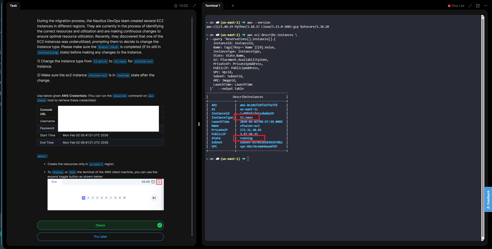

# 100 Days of Cloud - Day 7

# Change EC2 Instance Type

# Overview

# What does “changing an EC2 instance type” mean?
    It means switching your EC2 instance to a different hardware configuration (CPU, memory, networking, sometimes architecture) — for example, from t3.micro to t3.small, or from t3 to m6i.

# Why change an instance type?
Common reasons:
- 🚀 **Performance**: need more CPU/RAM
- 💰 **Cost optimization**: downgrade or move to a newer, cheaper family
- 📈 **Scaling**: handle more traffic
- 🧪 **Testing**: compare performance across instance families
- 🏗️ **Workload fit**: compute-optimized, memory-optimized, etc.

# High-level process
1. **Stop the instance** (required in most cases)
2. **Change the instance type** (via console, CLI, or API)
3. **Start the instance again**  
    ⚠️ Stopping the instance causes downtime and may change the public IP (unless you use an Elastic IP).

# Key things to check before changing
- **Instance family compatibility**
    - Some instance types require Nitro, ENA, or NVMe
- **Architecture**
    - x86 vs ARM (Graviton) — ARM requires compatible AMIs and software
- **Storage**
    - Instance store data is lost on stop/start
- **Networking limits**
    - Bandwidth and ENI limits vary by type
- **Licensing**
    - Some software licenses are tied to CPU/core count
- **Common scenarios**
    - **Vertical scaling**: t3.small → t3.medium
- **Family upgrade**: m5 → m6i
    - **Cost savings**: m5 → t4g (ARM, if compatible)
- **Burstable tuning**: switching between t sizes
# When you <i>don’t</i> need to stop
- If using **Auto Scaling Groups**, you usually change the **launch template** instead
    - Some Nitro instances support limited live changes, but **stop/start is still the norm**

**Day 7 Complete!**