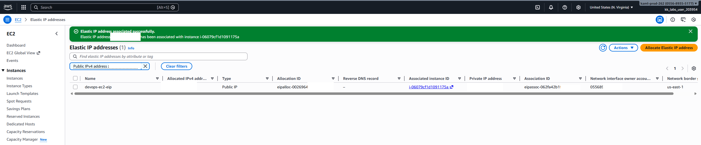

# Day 10 - Attach Elastic IP to EC2 Instance

# Overview

An **Elastic IP address (EIP)** is a **static, public IPv4 address** you can allocate in **Amazon Web Services (AWS)** and attach to cloud resources—most commonly an **EC2 instance**.

Here’s the idea in plain terms 👇

# What makes an Elastic IP special?

- **Static**: It doesn’t change, even if you stop/start your EC2 instance.
- **Public**: It’s reachable from the internet.
- **Flexible** (“elastic”): You can quickly remap it from one instance to another.

# Why would you use one?
Normally, when an EC2 instance restarts, its public IP can change. That’s annoying if:
# You’re hosting a website
-  You’ve whitelisted an IP somewhere
-  Clients or DNS records depend on a fixed IP

An Elastic IP solves that by giving you one permanent IP you control.

# Common use cases

- Hosting a web server that needs a fixed IP
- Failover setups (move the IP to a backup instance if the main one dies)
- External services that require IP allowlisting

# Cost gotcha ⚠️

AWS charges for Elastic IPs **when they’re not attached to a running instance.**
This is intentional—it discourages hoarding scarce IPv4 addresses.

# Quick example

1. Allocate an Elastic IP in AWS
2. Attach it to an EC2 instance
3. Users access your app via that IP
4. Instance fails? Reattach the same IP to a new instance → no DNS changes needed

**Day 10 Complete!**