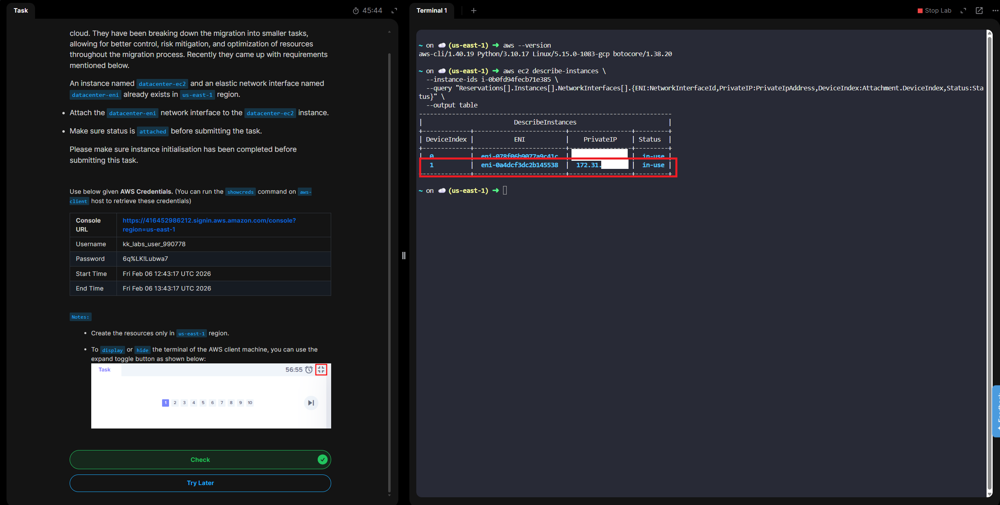

# Day 11 - Attach Elastic Network Interface to EC2 Instance

# Overview

An **Elastic Network Interface (ENI)** is basically a **virtual network card** in AWS that you attach to an EC2 instance.
Think of it like this:
👉 **EC2 instance** = computer
👉 **ENI** = network adapter plugged into that computer

# What an ENI includes

Each ENI comes with its own networking identity:
- Private IPv4 address (primary)
- Secondary private IPs (optional)
- Public IPv4 / Elastic IP (optional)
- MAC address
- Security groups
- Subnet
- Source/destination check setting

All of these stay with the ENI, not the instance.

# Why ENIs are useful
ENIs are powerful because they’re independent of the instance lifecycle:
- You can detach an ENI from one instance and attach it to another
- The IP addresses stay the same when you move it
- You can attach multiple ENIs to a single EC2 instance
- Each ENI can have different security groups

# Common real-world use cases

- High availability / failover  
    Move an ENI (and its IPs) to a standby instance during failures

- Multi-homed instances  
    One ENI for public traffic, another for private/backend traffic

- Network appliances  
    Firewalls, proxies, NAT instances

- Running multiple services  
    Different security rules per service

# Primary vs secondary ENI

- Primary ENI
    - Created automatically when the EC2 instance launches
    - Has DeviceIndex = 0
    - Cannot be detached while the instance is running

- Secondary ENI
    - Manually attached
    - Can be detached and reattached
    - Has DeviceIndex ≥ 1

# ENI vs Elastic IP (quick clarity)
- ENI = the network interface itself
- Elastic IP = a public IP that can be attached to an ENI

# Simple mental model
- ENI is the container, IPs and security groups are the contents, and EC2 is the host.

**Day 11 Complete!**