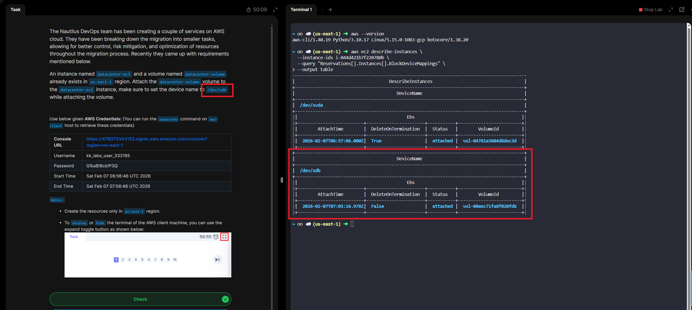

# Day 12 - Attach Volume to EC2 Instance

# Overview

In AWS, a volume is a storage resource used to store data for compute services, mainly EC2.

# Main Volume Types in AWS

| Volume Type | Description| Persistence | Typical Use |
| -------------------| -----------| ----------- | ------------| 
| EBS (Elastic Block Store) | Block storage attached to EC2 | Persistent | OS Disks, Databases,applications | 
Instance Store | Local storage on EC2 host | Temporary | Cache, scratch data |
EFS (Elastic File System) | Shared file storage | Persistent | Shared data across instances

# Key Characteristics
| Feature | Details|
|---------|--------|
| Attachement | Volumes attach to EC2 instances |
| Availability Zone | EBS volumes are AZ-specific | 
| Durability | EBS data persists independently of EC2  |
| Scalability | Volume size can be increased | 
| Snapshots | EBS supports backups via snapshots | 

**Day 12 Complete!**