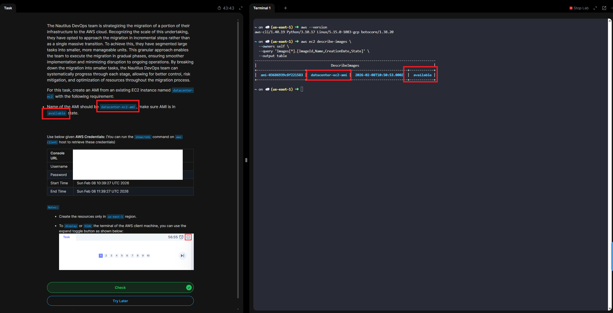

# Creating AMI from EC2 Instance

# Overview 

Think of it as a **blueprint** for a virtual server (EC2 instance) in AWS.

Here’s what an AMI includes:

- 🧠 **Operating system** (Amazon Linux, Ubuntu, Windows, etc.)
- 📦 **Preinstalled software** (web servers, databases, custom apps)
- ⚙️ **Configuration & settings** (users, permissions, startup scripts)
- 💾 **Root volume snapshot** (the disk image)

When you launch an EC2 instance, you choose an AMI, and AWS uses it to create that instance exactly as defined.

# Why AMIs are useful

- Fast setup – spin up servers in minutes
- Consistency – every instance starts the same way
- Scalability – perfect for auto-scaling groups
- Backup & recovery – AMIs can be created from existing instances

# Types of AMIs

- AWS-provided AMIs – official, maintained by AWS
- Marketplace AMIs – third-party (often paid)
- Community AMIs – shared by other users
- Custom AMIs – ones you create from your own instances