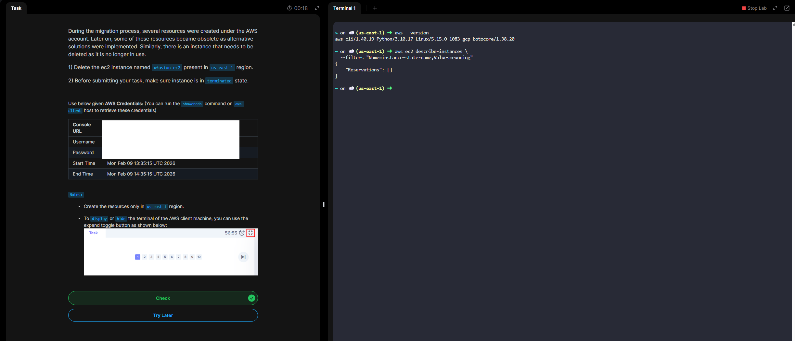

Day 14 - Terminate EC2 Instance

# What “Terminate EC2 Instance” means

Terminating an EC2 instance **permanently deletes the instance**. Once terminated:

- The instance **stops running immediately**
-** You can’t restart or recover it**
- Instance-store (ephemeral) data is lost forever
- You **stop being billed** for that instance (EBS storage may still cost money)

Think of Terminate = **delete**, not stop.

# What happens to attached resources

- Root EBS volume
    - Deleted by default on termination
    - Can be preserved if “Delete on termination” was disabled

- Additional EBS volumes
    - Not deleted automatically
    - Must be deleted manually to avoid charges

- Elastic IP
    - Disassociated but still billed if not released

- Security groups / key pairs
    - Not affected

# When you should terminate vs stop

- Terminate when:
    - The instance is no longer needed
    - It was created for testing, CI, or short-lived workloads
- Stop when:
    - You may need the instance again
    - You want to keep the OS, data, and configuration intact

Permissions required

You need IAM permission:

- *ec2:TerminateInstances*

Without it, the option will be disabled or denied.

# Best-practice safety tips

- ✅ Take an AMI snapshot if you might need it later
- ✅ Verify EBS delete-on-termination settings
- ⚠️ Double-check instance ID (termination is irreversible)
- 🔐 Use termination protection for critical instances

**Day 14 Complete!**