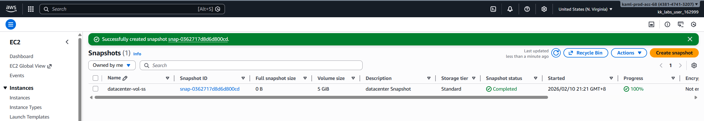

# Day 15 - Create Volume Snapshot

# Overview

An **AWS Snapshot** is a **point-in-time backup** of data stored on AWS, most commonly for **Amazon EBS (Elastic Block Store)** volumes.

# What an AWS Snapshot is

- A snapshot is a **backup** of your data at a specific moment
- It’s stored in Amazon S3 (managed by AWS—you don’t see the bucket)
- It’s incremental: after the first snapshot, AWS only saves the **changes**, which saves money and time

# What snapshots are used for
- 🛡️ Backup & recovery – restore data if something breaks
- 📦 Create new volumes – spin up identical EBS volumes
- 🚀 Move data – copy snapshots across regions or accounts
- 🧪 Testing & cloning – duplicate environments safely

# Common types of AWS snapshots

- EBS Snapshots – backups of EC2 disk volumes (most common)
- RDS Snapshots – database backups (automated or manual)
- Redshift Snapshots – data warehouse backups

**Day 15 Complete!**