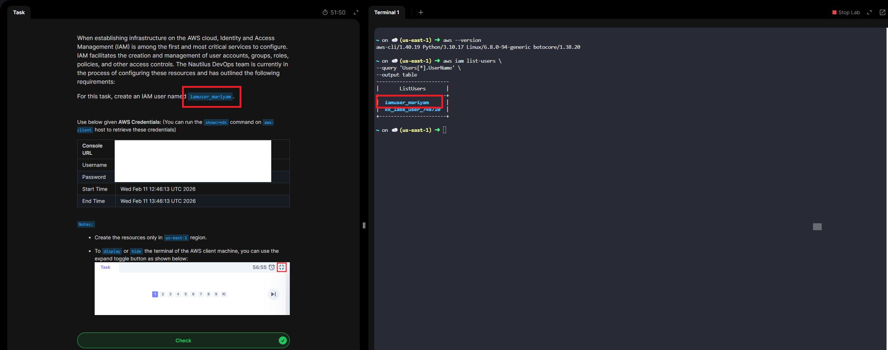

# Day 16 - Create IAM User

# Overview

**IAM (Identity and Access Management)** is a framework of policies and technologies that ensures the **right users and systems get the right access to the right resources at the right time.**

# Core Functions

- **Authentication** – Verifies identity (passwords, MFA, biometrics, SSO).
- **Authorization** – Controls permissions (roles, policies, least-privilege access).
- **User Lifecycle Management** – Creates, updates, and removes access as people join, change roles, or leave.
- **Auditing & Monitoring** – Tracks activity for security and compliance.

# Why It Matters

- Prevents unauthorized access
- Reduces security risks
- Ensures regulatory compliance
- Centralizes access control across systems

# Common in
- Enterprise IT systems
- SaaS applications

In short: **IAM is the security layer that controls digital access across an organization**.

**Day 16 Complete!**