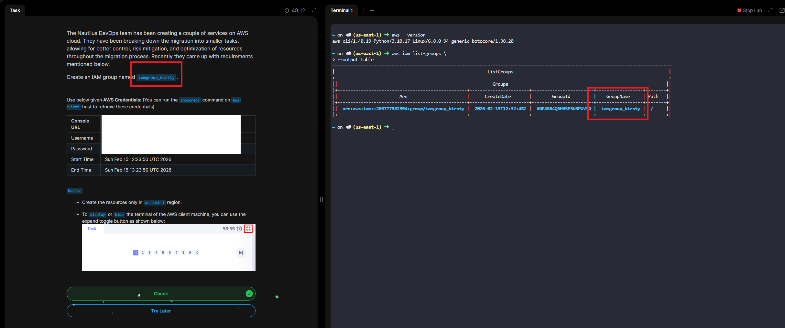

# Day 17 - Create IAM Group

# Overview

# An IAM group:

- Contains IAM users (not roles or other groups)
- Has permission policies attached
- Makes it easier to manage access for multiple users at once

Instead of assigning permissions individually to each user, you assign permissions to the group — and all users in that group inherit those permissions.

# Example

Imagine you have:
- 5 developers
- 3 finance team members

You could create:

- Developers Group → Access to EC2, S3, Lambda
- Finance Group → Access to billing and cost reports

When you add a user to the Developers group, they automatically get the same permissions as the rest of the developers.

# Key Characteristics

- ✅ Groups contain users only
- ✅ Users can belong to multiple groups
- ❌ Groups cannot be nested (no group inside another group)
- ❌ Groups do not have credentials (users do)

# Why Use IAM Groups?

- Easier permission management
- Consistent access control
- Follows least privilege principle
- Scales well as your organization grows