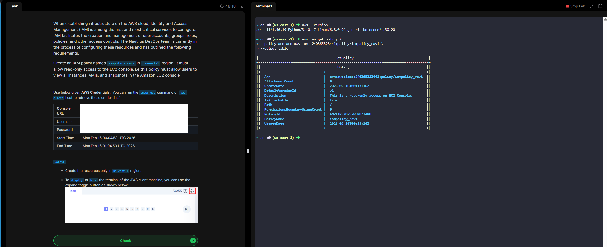

# Create Read-Only IAM Policy for EC2 Console Access

# Overview

# 🎯 Objective
Allow users to: 

- ✅ View EC2 resources in the AWS Console
- ❌ Not create, modify, or delete anything

This applies only to Amazon EC2 resources.

# Option 1: Use AWS Managed Policy (Recommended)

AWS provides a ready-made managed policy:

# AmazonEC2ReadOnlyAccess

This policy allows:
- Viewing EC2 Instances
- Viewing AMIs
- Viewing Security Groups
- Viewing EBS Volumes & Snapshots
- Viewing Key Pairs
- Viewing Auto Scaling configurations

**Day 18 Complete!**

