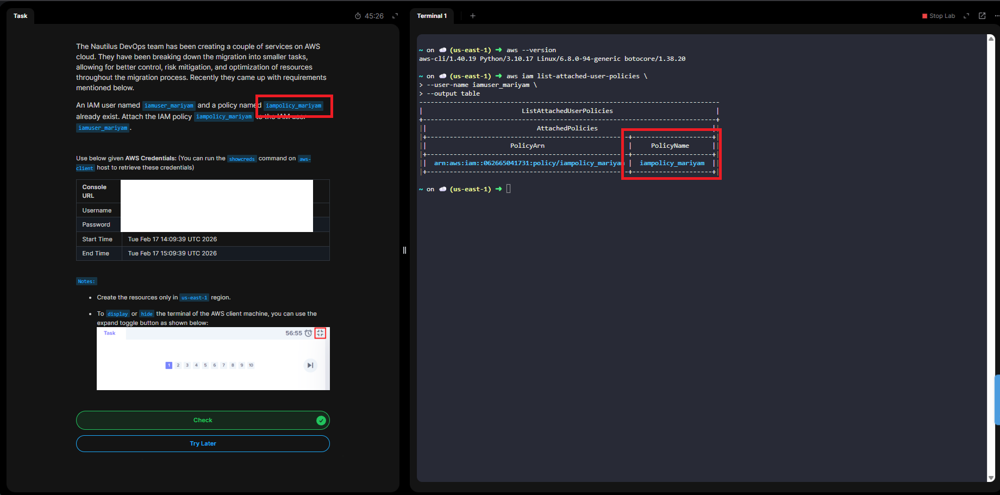

# Day 19 - Attach IAM Policy to IAM User

# Overview
An IAM policy is a document that defines who can do what on which resources in a cloud environment.

# 🔐 What an IAM Policy Does
An IAM policy answers three key questions:

- Who (user, group, role)
- What action (read, write, delete, etc.)
- On which resource (server, database, bucket, etc.)

# 👥 Where IAM Policies Are Used
In Amazon Web Services, policies can be attached to:
- Users
- Groups
- Roles
- Resources (like S3 buckets)

# 🧠 Why IAM Policies Matter

They help enforce:
- Security (least privilege access)
- Compliance
- Access control
- Separation of duties
- Without IAM policies, anyone could access or modify resources.

**Day 19 Complete!**

