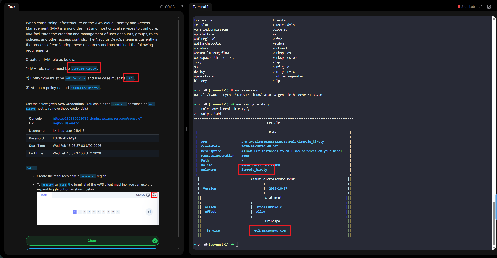

# Day 20 - Create IAM Role for EC2 with Policy Attachment

# Overview

IAM Role is an identity in **Amazon Web Services (AWS)** that grants **temporary permissions** to access AWS resources - without using long-term credentials like username and passwords.

It's a part of AWS **Identity and Access Management (IAM)**

Think of an IAM Role like a temporary badge you assume to get specific access.

Instead of permanently attaching permissions to a user, a role:
- Has a defined set of permissions
- Can be assumed by trusted entities
- Provides temporary security credentials

# 👤 Who Can Assume an IAM Role?
- An AWS service (like Amazon EC2)
- Another AWS account
- An IAM user
- An application
- An external identity provider (SSO, OIDC, etc.)

# 🧠 Why IAM Roles Are Important

- Improve security (no hardcoded credentials)
- Enable cross-account access
- Used heavily in automation & DevOps
- Required for many AWS services

**Day 20 Complete!**