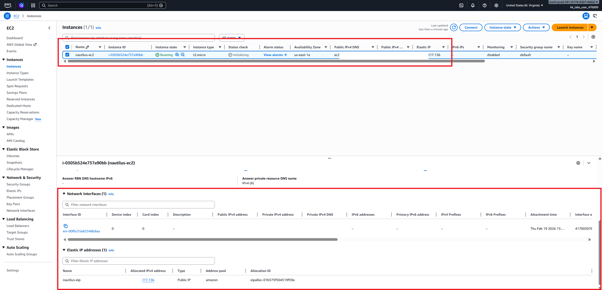

# Day 21: Setting Up an EC2 Instance with an Elastic IP for Application Hosting

After explaining the concepts of an EC2 instance and an Elastic IP in my previous tasks, I moved forward with configuring an EC2 instance and attaching an Elastic IP address for application hosting.

# What I accomplished in this task:
    - Successfully launched an EC2 Instance.
    - Allocated an Elastic IP Address 
    - Associated the Elastic IP Address with the EC2 Instance
    - Verified the connection between the instance and the Elastic IP using the AWS CLI.

**Day 21 Complete!**