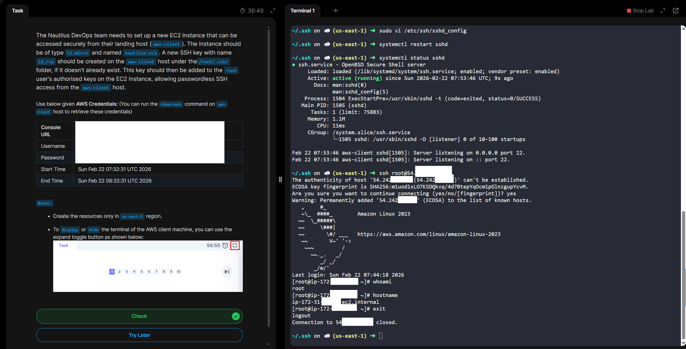

# Day 22 -  Configuring Secure SSH Access to an EC2 Instance

# Objective
The goal of this task is to securely configure SSH (Secure Shell) access to an Amazon EC2 instance so administrators can safely connect to and manage the server remotely.

This process ensures:
- Encrypted remote access
- Restricted network exposure
- Proper authentication controls
- Reduced risk of unauthorized access

# What is SSH?
- SSH (Secure Shell) is a secure network protocol used to remotely access and manage computers over an encrypted connection.

- It allows you to log into a remote machine (like a cloud server) and execute commands as if you were physically sitting in front of it — but safely over the internet.

# 🔐 What Makes SSH Secure?

SSH provides:
- Encryption – All data transmitted is encrypted
- Authentication – Verifies the identity of users (via passwords or key pairs)
- Integrity – Prevents tampering during transmission

# 💻 Where Is SSH Commonly Used?
- Managing cloud servers like Amazon EC2
- Administering Linux servers
- Secure file transfers (via SCP or SFTP)
- Git repository access
- Network device management

**Day 22 Complete!**