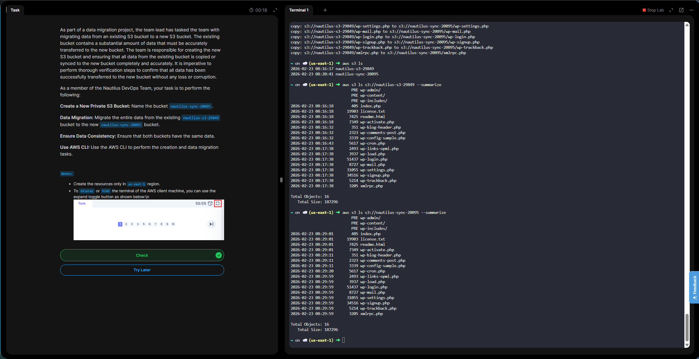

# Day 23 - Data Migration Between S3 Buckets using AWS CLI 

# Overview

# What is S3?
**Simple Storage Service (s3)** offers a **highly scalable object storage service** used for :
- Backups and archives
- Static website hosting
- Data lakes
- Application Assets
- Logs and analytics storage

**Buckets** are containers for storing objects (files + metadata)

**Metadata** = It describes, explains, or gives additional information about a piece of data.

# Why Migrate Data Between S3 Buckets?

Common reasons include:

- 🔄 Moving data between environments (dev → staging → prod)
- 🌍 Cross-region migration (latency or compliance reasons)
- 🏢 Cross-account transfers
- 💰 Cost optimization (storage class changes)
- 🔐 Security restructuring
- 📦 Backup and disaster recovery

**Day 23 Complete!**