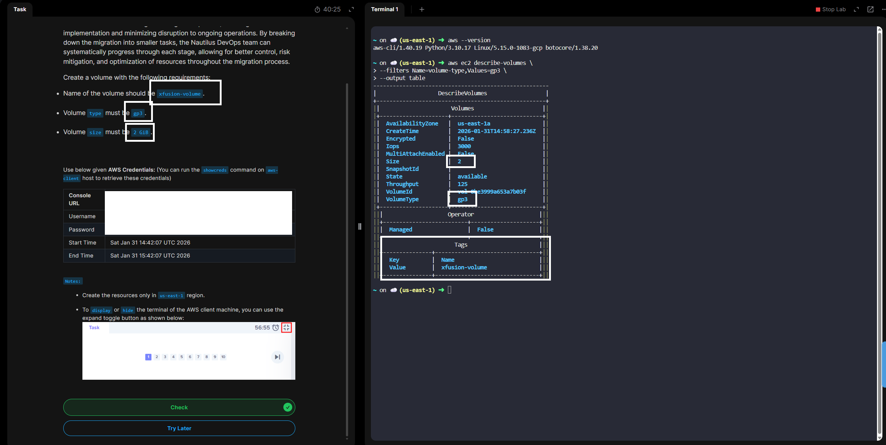

# 100 Days of Cloud - Day 5

## Create a gp3 Volume

# Overview
gp3 in **AWS** is a type of **Amazon EBS** **(Elastic Block Store)** volume — basically a general-purpose SSD storage option for EC2 instances.

Think of it as **gp2’s smarter, cheaper, more flexible successor.**

# What makes gp3 special?

- **SSD-backed** → good performance for most workloads

- **Decoupled performance & size** → you can set IOPS and throughput independently of volume size

- **Cheaper than gp2** → lower $/GB and better baseline performance

# Default performance (out of the box)

- **3,000 IOPS** 

    **IOPS** - Input/Output Operations Per Second.

- **125 MB/s throughput**

You can scale up to:

- **16,000 IOPS**

- **1,000 MB/s throughput**

…and you only pay extra if you actually provision higher IOPS or throughput.

# Common use cases
- Databases (MySQL, PostgreSQL, etc.)
- Boot volumes
- Application servers
- Dev/test and production workloads
- Basically anything that used to run on gp2

**Day 5 Complete!**