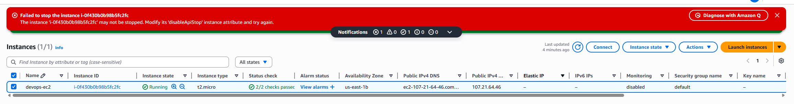

# Day 8 - Enable Stop Protection for EC2 Instance

# Overview

**Stop Protection** (officially called **Stop instance protection**) is a safety feature in AWS EC2 that **prevents an instance from being stopped accidentally.**

When it’s enabled, AWS will block:
- Manual Stop actions from the Console, CLI, or API
- Automated stop actions from scripts or tools that don’t explicitly disable protection first

# What it protects against

It helps avoid downtime caused by:

- Someone clicking Stop in the AWS Console by mistake
- Automation or scripts that stop instances during cleanup or cost-saving jobs
- Misconfigured scaling or operational tools

# What it does not protect against

Important nuance:
- ❌ It does not prevent Terminate
- ❌ It does not protect against instance failure
- ❌ It does not block reboots

If you want termination protection, that’s a separate setting called **Termination Protection**.

# Typical use cases

Stop Protection is commonly enabled for:

- Production EC2 instances
- Critical backend services
- Long-running workloads that should never be paused
- Instances with attached stateful data or special licensing

# How it works in practice

- If someone tries to stop the instance → AWS returns an error
- To stop it intentionally, you must disable stop protection first, then stop the instance

# Key takeaway

Think of Stop Protection as:
“Are you really sure you want to stop this server?”

**Day 8 Complete!**