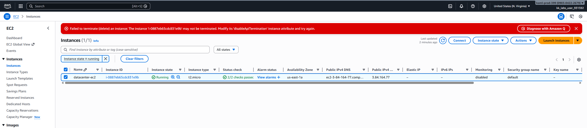

# Day 9 - Enable termination Protection

# Overview

**Termination protection** is a safety feature in AWS that helps **prevent accidental deletion of critical resources**, especially compute and infrastructure components. When enabled, AWS blocks termination actions unless the protection is explicitly turned off first.

Think of it as a “are you really sure?” lock for important resources 🔐

# Where Termination Protection Applies
# 1. Amazon EC2 Instances
- Prevents an EC2 instance from being terminated via:
    - AWS Console
    - CLI
    - SDKs

- You must disable termination protection before terminating the instance.
- Does not prevent:
    - Stopping the instance
    - Rebooting
    - Deleting attached volumes manually

📌 Common use case: production servers, bastion hosts, legacy workloads.

# 2. Auto Scaling Groups (ASG)
- Auto Scaling has its own flavor of protection:
    - Instance Scale-In Protection
- Prevents specific instances from being terminated during:
    - Scale-in events
    - Auto Scaling updates

📌 Useful for:
    - Stateful workloads
    - Long-running jobs
    - Debugging live instances

# 3. Amazon RDS
- Deletion protection (similar concept)
- Prevents accidental database deletion
- You must disable deletion protection before deleting the DB instance

📌 Strongly recommended for production databases.

# 4. CloudFormation Stacks
- Termination protection for stacks
- Prevents deletion of the entire stack
- Individual resources can still be modified (depending on policies)

📌 Ideal for core infrastructure stacks (networking, IAM, security).

# 5. Other AWS Services with Similar Concepts

While not always called “termination protection,” many services offer safeguards:
- S3: MFA Delete, Object Lock
- EBS: “Delete on termination” flag
- IAM: Service Control Policies (SCPs)
- Organizations: Prevent account deletion or risky actions

# What Termination Protection Does Not Do

- It does not protect against:
    - Manual disabling by someone with permissions
    - Data loss inside the resource
    - Stopping or modifying resources (unless explicitly restricted)

👉 It’s a guardrail, not a security boundary.

# Best Practices
- Enable termination protection on:
    - Production EC2 instances
    - RDS databases
    - Core CloudFormation stacks

- Combine with:
    - IAM least-privilege policies
    - AWS Config rules
    - Monitoring and alerts

- Document when and why protection is enabled (future you will thank you)

**Day 9 Complete!**